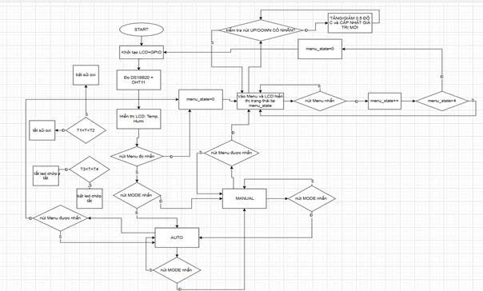
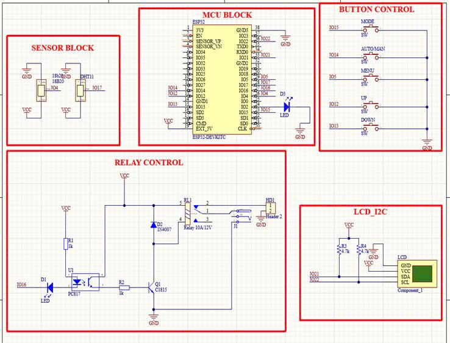
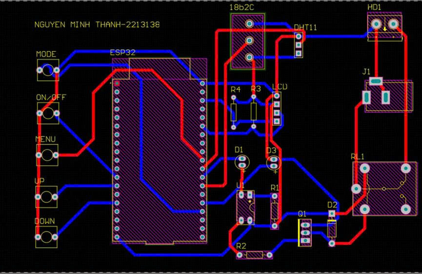
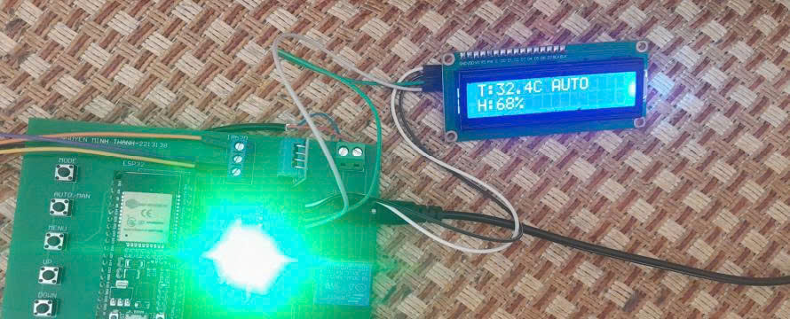

# 🐟 Control-Fish: Temperature & Humidity Control System for Aquarium

## 📌 Introduction
This project implements an **aquarium environment monitoring and control system** using an **ESP32 microcontroller** with temperature and humidity sensors.  
The system continuously measures environmental parameters and controls external devices through relays, supporting both **automatic** and **manual** modes:contentReference[oaicite:0]{index=0}.

---

## 🔧 Features
- **Sensors**: DS18B20 (temperature) and DHT11 (temperature + humidity).  
- **Display**: 16x2 LCD with I2C interface to show temperature, humidity, and system state.  
- **Control**: Relay switching external devices (e.g., oxygen pump).  
- **Modes**: AUTO (relay based on thresholds T1–T2) and MANUAL (user control).  
- **Configuration**: Adjustable thresholds T1–T4 through button menu.  
- **Alerts**: LED blinking when temperature exceeds safe limits (T3–T4).  
- **Firmware**: Built on ESP-IDF with FreeRTOS task handling:contentReference[oaicite:1]{index=1}.  

---

## 🖼️ System Diagram

---

## 📐 Schematic

---

## 🖥️ PCB Layout

---

## 📊 Results & Evaluation

- Accurate measurement: DS18B20 ±0.5 °C, DHT11 ±1% RH.  
- AUTO mode: relay switching within thresholds (24–28 °C).  
- MANUAL mode: direct relay control by user.  
- LED alerts triggered when temperature < 20 °C or > 35 °C.  
- Stable system operation with low error rates:contentReference[oaicite:2]{index=2}.  

---

## ⚙️ Components
- ESP32 DevKit V1  
- DS18B20 temperature sensor  
- DHT11 temperature & humidity sensor  
- LCD 16x2 with I2C module  
- Relay 5V + C1815 transistor + PC817 opto-isolator  
- LED for alerts  
- Buttons: MENU, MODE, UP, DOWN, ON/OFF  
- 5V DC power supply  
- Oxygen pump  

---

## ✅ Conclusion
- System achieved stable measurement and control as designed.  
- Small, low-cost, and easy to use.  
- Can be extended to IoT applications (remote monitoring via Wi-Fi, data logging, mobile/web dashboard).  

---

## 👨‍💻 Author
- Nguyễn Minh Thành – Ho Chi Minh City University of Technology (HCMUT)  

---

## 📫 Contact
✉️ Email: **nguyenminhthanh.offfice@gmail.com**

